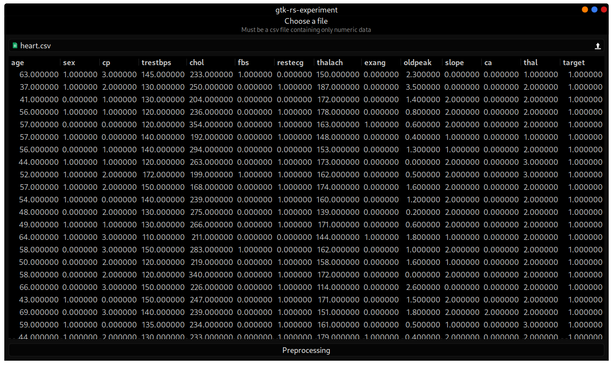
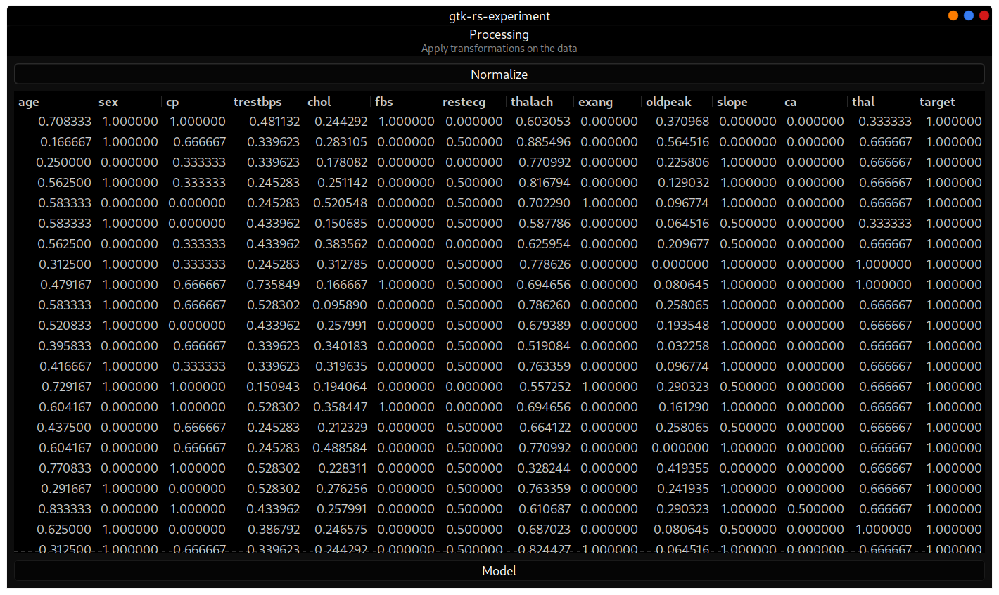
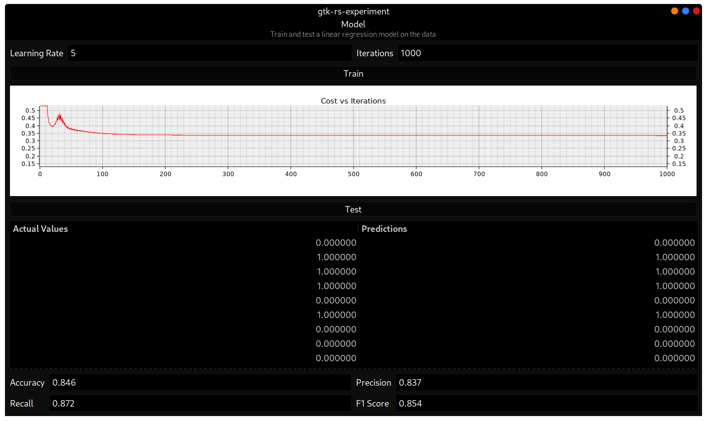

# gtk-rs-experiment

An app to experiment with [gtk-rs](https://gtk-rs.org/), a library in Rust to 
create GTK applications. The app is a walk-through of a simple machine learning
pipeline. [polars](https://github.com/pola-rs/polars) provides its efficient 
`DataFrame` while [ndarray](https://github.com/rust-ndarray/ndarray) with its
`Array` powers the machine learning section and [plotters](https://github.com/38/plotters)
the graph.

This app has three "pages" each showcasing a section of the ML process:

1. First, we select the `csv` we want to train our model on. The data has to be
numeric. The data from the file is seen below. Clicking on "Preprocessing" will
take us to the next step.

2. Second, we perform pre-processing on this dataset, which in this case is just
normalizing the dataset. This makes it so that none of the values influence our
model unevenly. On clicking the "Normalize" button we can see the data in the
table change. Then, we click on "Model" to go to the next step.

3. Lastly, we train a logistic regression model on this dataset. We input the
learning rate and the number of iterations. Clicking on "Train" trains the model.
Once trained a cost vs iterations graph is displayed which is an easy to way to
compare the performance of the two sets of hyper-parameters. Then, we can test 
the model by clicking on "Test" and see various metrics to evaluate the
performance of the model.

## Why such a fringe use case?
We had a college assignment in which we had to implement a very basic machine
learning algorithm with GUI. Although, for me personally using web would've 
been easy and probably looked better, I thought it would be a nice opportunity 
to practice a bit of `Rust`! Which is why this project makes absolutely no
sense and has literally no error handling (`.unwrap()`s everywhere 😱).
